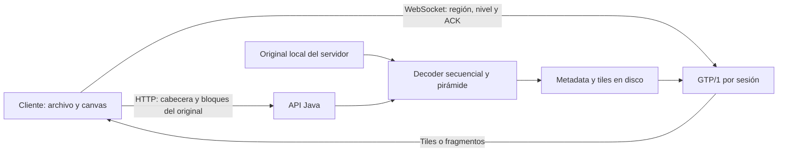
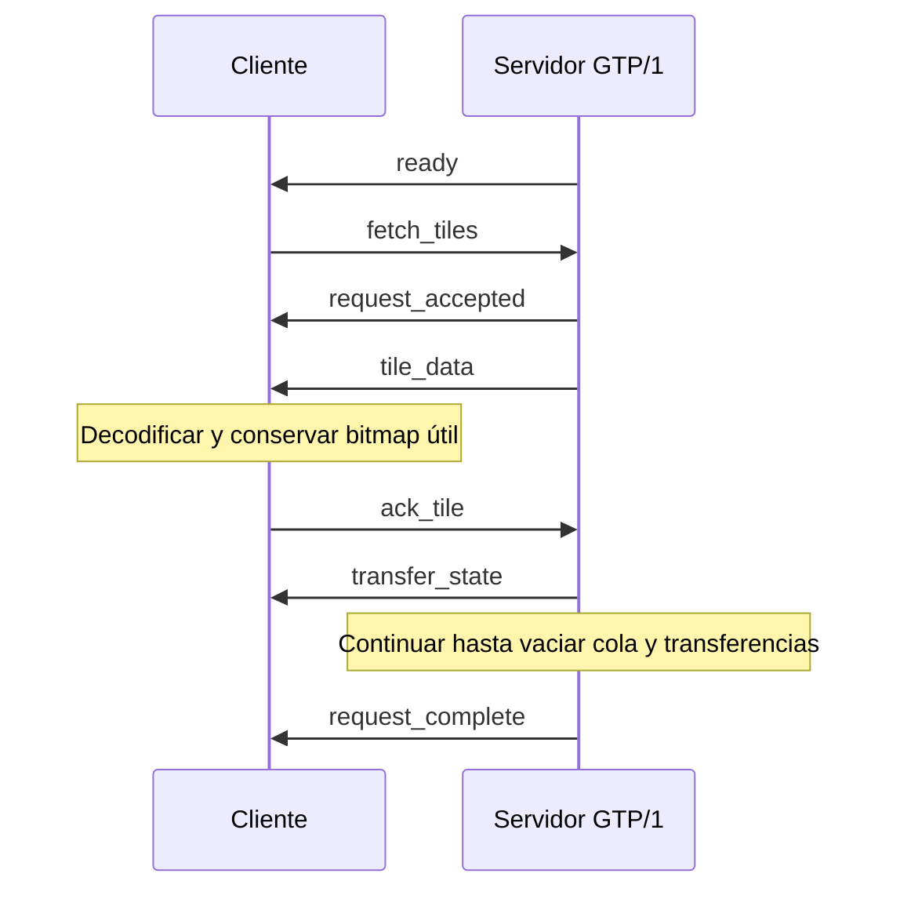

# RFC interno GTP-001 — Gigapixel Tile Protocol, versión 1

| Campo | Valor |
|---|---|
| Proyecto | Servidor asíncrono de imágenes — Ciencias de la Computación VIII |
| Autores del proyecto | Ricardo Caballeros y Cristian Sactic |
| Identificador local | GTP-001 |
| Protocolo en el canal | `GTP/1`, `version: 1` |
| Estado | Especificación de la implementación vigente, para revisión y defensa |
| Fecha de revisión documental | 2026-10-07 |
| Implementación | Java 21 / Spring Boot 3.2.4; navegador con JavaScript y Canvas |

## Estado de este documento

Este es un **RFC interno del proyecto**, no un RFC publicado por el IETF ni un
estándar registrado. GTP significa *Gigapixel Tile Protocol* en este proyecto.
Describe la solución implementada, su contrato, decisiones y evidencia disponible.
No afirma que la evaluación con originales de hasta 93 GB haya sido completada.

El contrato operativo detallado está en [docs/protocolo.md](docs/protocolo.md).
Este RFC mantiene la arquitectura, los algoritmos y sus razones; el contrato
mantiene campos, validaciones y efectos observables de los mensajes. Las guías de
uso remiten a ambos sin definir variantes del mismo protocolo.

El diseño previo se conserva en
[docs/historico/diseno_protocolo_previo.md](docs/historico/diseno_protocolo_previo.md).
La [historia seccionada](docs/historico/README.md) relaciona decisiones anteriores,
cambios y evidencias. La reorganización documental del 2026-10-07 no cambia el
protocolo ni representa una nueva ejecución de las pruebas registradas.

## Resumen

La solución permite navegar cualquier región de un PNG original sin cargarlo
completo en el navegador. Java recibe o localiza el original, lo procesa
secuencialmente y construye una pirámide de tiles en disco. El cliente solicita
solo el nivel y la región necesarios para su vista. Al ajustar se muestra la imagen
completa reducida; a 1:1 se solicitan tiles nativos PNG para conservar el detalle.

Sobre WebSocket/TCP, GTP añade confirmaciones de aplicación, ventanas y presupuestos
de bytes, fragmentación opcional, recuperación por timeout y cancelación de trabajo
obsoleto. La memoria retenida se gestiona mediante LFU con envejecimiento y TTL en
el servidor, y protección espacial con TTL en el cliente.

## Contenido

1. [Convenciones y terminología](#1-convenciones-y-terminología)
2. [Problema, alcance y arquitectura](#2-problema-alcance-y-arquitectura)
3. [Modelo de imagen y almacenamiento](#3-modelo-de-imagen-y-almacenamiento)
4. [Recepción y procesamiento del original](#4-recepción-y-procesamiento-del-original)
5. [Transporte e identidad de mensajes](#5-transporte-e-identidad-de-mensajes)
6. [Solicitud, confirmación y estados](#6-solicitud-confirmación-y-estados)
7. [Fragmentación y reconstrucción](#7-fragmentación-y-reconstrucción)
8. [Control de flujo y recuperación](#8-control-de-flujo-y-recuperación)
9. [Orden de envío y cancelación](#9-orden-de-envío-y-cancelación)
10. [Políticas de memoria y TTL](#10-políticas-de-memoria-y-ttl)
11. [Renderizado y adaptación](#11-renderizado-y-adaptación)
12. [Decisiones y alternativas](#12-decisiones-y-alternativas)
13. [Seguridad, interoperabilidad y límites](#13-seguridad-interoperabilidad-y-límites)
14. [Verificación y resultados](#14-verificación-y-resultados)
15. [Pendientes y referencias](#15-pendientes-y-referencias)

## 1. Convenciones y terminología

Las palabras **DEBE (MUST)**, **NO DEBE (MUST NOT)**, **DEBERÍA (SHOULD)** y
**PUEDE (MAY)** expresan requisitos, prohibiciones, recomendaciones y opciones de
este contrato local, siguiendo la distinción de RFC 2119 y RFC 8174. Las descripciones
de pruebas y propuestas futuras no se convierten por ello en requisitos implementados.

| Término | Significado |
|---|---|
| Original | PNG completo proporcionado por el usuario o disponible en el servidor. |
| Tile | Bloque de píxeles de un nivel de la pirámide. |
| `z` | Nivel de resolución: 0 es reducido; `maxZoom` es nativo. |
| `q` | Variante de calidad/codificación de un tile, independiente de `z`. |
| Vista / viewport | Región de la imagen que corresponde al área visible del canvas. |
| Payload | Bytes de imagen codificada, antes de Base64 y cabeceras JSON. |
| ACK | Confirmación de aplicación; no es el ACK de TCP. |
| TTL | Tiempo de retención fuera de alcance o por inactividad, según la caché. |
| RTO | Tiempo de espera antes de retransmitir una transferencia sin confirmar. |

Tamaños del protocolo se expresan en **bytes**, duraciones en **milisegundos**.
`1 MiB = 1 048 576 bytes`. Los tamaños de originales comunicados como KB/GB no
determinan sus dimensiones ni la RAM necesaria para decodificarlos.

## 2. Problema, alcance y arquitectura

Los insumos son PNG completos, con una escalera de tamaños comunicada desde 32 KB
hasta 93 GB. No se exige al usuario entregar tiles preparados. La necesidad es
ver la imagen completa al alejarse y conservar detalle al acercarse a una región;
transferir el archivo entero hacia el navegador no es el objetivo de navegación.



Dos capas cumplen funciones distintas:

- **HTTP:** recursos estáticos, inspección, registro, subida del original, ingesta,
  catálogo, metadata, estado y estadísticas de caché.
- **WebSocket/TCP:** sesión bidireccional para solicitudes y transferencia de tiles.
  TCP entrega un flujo ordenado; GTP controla consumo y relevancia en la aplicación.

Todos los recursos de ejecución se sirven desde Java, sin CDN ni peticiones
externas. Playwright es una herramienta externa de pruebas, no de producción.
La propuesta de navegación por regiones es conceptualmente afín a JPIP, pero no
se implementa su formato ni se declara compatibilidad con ese estándar.

## 3. Modelo de imagen y almacenamiento

Para un original `W × H` y tile de lado `T`, el nivel nativo contiene:

```text
columnas = ceil(W / T)
filas    = ceil(H / T)
tiles    = columnas × filas
W[z-1]   = ceil(W[z] / 2)
H[z-1]   = ceil(H[z] / 2)
```

Se reduce hasta que ancho y alto caben en un tile; ese nivel es `z=0`. La metadata
enumera dimensiones, columnas, filas y cantidad por nivel. El visor permite
preparar tiles de 256 o 512 px. Los tiles de borde pueden ser más pequeños.

La identidad multinivel es `imageId:z:x:y:q`; `x` e `y` son índices de tile del
nivel, no coordenadas de pantalla. El catálogo plano histórico utiliza
`imageId:x:y`, `z=null` y calidad nativa. Se mantiene para compatibilidad y diagnóstico.

| q | Implementación disponible en el servidor | Uso del visor actual |
|---|---|---|
| 0 | PNG indexado 64×64; vecino más cercano; hasta 256 colores de mayor frecuencia, asignados por distancia RGB. | No lo solicita automáticamente. |
| 1 | JPEG, parámetro de calidad 0,50; transparencia compuesta sobre blanco. | No lo solicita automáticamente. |
| 2 | JPEG, parámetro de calidad 0,85; transparencia compuesta sobre blanco. | No lo solicita automáticamente. |
| 3 | Bytes del tile PNG nativo del nivel, sin recodificación de calidad. | Variante utilizada para la vista final y el respaldo. |

Los niveles reducidos pierden detalle espacial intencionalmente; **q3 en un nivel
reducido no equivale a resolución original**. El detalle nativo se obtiene en
`z=maxZoom, q=3`. No hay WebP ni refinamiento automático q0→q3 implementado.

```text
<GTP_IMAGES>/original.png             fuente del servidor, sin modificar
<GTP_WORK>/<imageId>/meta.json         registro, niveles, estado y SHA-256
<GTP_WORK>/<imageId>/source.part       copia subida, si corresponde
<GTP_WORK>/<imageId>/tiles/<z>/<x>_<y>.png
<GTP_WORK>/<imageId>/tiles/complete.sha256
```

La caché de variantes es RAM; no existe un directorio `.cache` generado por esta
implementación. `availableQualities:[3]` identifica la salida preparada, aunque
el servidor puede derivar q0–q2 bajo demanda. No se utiliza base de datos.

## 4. Recepción y procesamiento del original

### 4.1. Registro y transferencia

La inspección lee 33 bytes: firma e IHDR con CRC. Calcula dimensiones y estimaciones;
**no verifica la integridad de IDAT ni del archivo entero**. El registro persiste
metadata con estado `pending` y la cabecera esperada.

La vista previa local opcional solo abre archivos de hasta 4 megapíxeles y 16 MiB.
Decodifica ese PNG pequeño en el navegador, sin GTP; no sustituye ni prueba el
recorrido servidor/pirámide de los originales grandes.

La subida HTTP utiliza bloques binarios de hasta 1 MiB y un `offset`. El servidor
DEBE aceptar únicamente el offset correspondiente a la longitud persistida de
`source.part`, verificar el tamaño declarado y comprobar la cabecera del primer
bloque. Una discrepancia de offset devuelve conflicto; el cliente consulta el
offset recibido antes de reanudar. El navegador utiliza `File.slice`, no un buffer
del original completo. También PUEDE procesarse un archivo bajo `GTP_IMAGES`.

Reanudar la **subida** no significa reanudar el decoder ni una transferencia GTP.
Un procesamiento fallido se reintenta desde el inicio del PNG.

### 4.2. Decoder, pirámide y publicación

`SequentialPngDecoder` descomprime IDAT secuencialmente, invierte los cinco filtros
PNG y conserva dos filas empaquetadas y una fila RGBA8. Para ancho `W` y fila
empaquetada `R`, sus buffers principales requieren `2R + 4W` bytes, más estructuras
de descompresión/codificación. El presupuesto de ingesta reserva además 32 MiB de
margen; no es una medición de RSS.

`PngPyramidBuilder` escribe una banda RGBA temporal **en disco**. Al completar
hasta `T` filas, extrae y codifica tiles nativos y reutiliza la banda. Después
construye cada nivel inferior desde hasta cuatro tiles hijos y un tile resultado.
La reducción promedia áreas 2×2, pondera colores por alpha y maneja bordes impares.
ImageIO se aplica a tiles, no a la imagen original gigante.

Para invertir filtros se usan `a` (byte izquierdo a distancia bpp), `b` (byte de
fila anterior) y `c` (anterior-diagonal); los ausentes valen 0. Se suma al byte
filtrado, módulo 256, la predicción: None=0, Sub=a, Up=b, Average=floor((a+b)/2).
Paeth elige entre a/b/c el más cercano a `p=a+b-c`, con prioridad a y luego b en
empates. Esto explica por qué bastan las filas actual/anterior para reconstruir.

Se validan chunks/CRC, filtros, Deflate, IDAT e IEND; se calcula SHA-256 del original.
La pirámide se construye en `.p3-tiles`, se marca completa y se publica mediante
movimiento atómico a `tiles`. Solo después pasa a `ready`. Un fallo o cancelación
deja `failed` y limpia la salida temporal. Si el sistema de archivos no permite
la publicación atómica requerida, no se declara éxito.

```text
pending ──inicio──> processing ──validación/publicación──> ready
                       │
                       └──fallo/cancelación/interrupción──> failed
failed ──reintento explícito──> processing
```

Hay una ingesta por raíz de trabajo, protegida por semáforo local y bloqueo de
archivo entre procesos. La ingesta usa un ejecutor de un hilo. Se comprueba espacio
para la pirámide estimada y banda, con reserva de 16 MiB en las escrituras.

### 4.3. Fidelidad y variantes soportadas

Se admiten PNG no entrelazados: grayscale/indexado de 1/2/4/8 bits y RGB, grayscale
con alpha y RGBA de 8 bits. Se soportan PLTE y tRNS según el tipo. Adam7, 16 bits
y APNG se rechazan; no se convierten silenciosamente con pérdida.
Los tiles nativos conservan los valores de píxel admitidos, no los bytes del
original ni sus chunks auxiliares. ICC/gamma/texto no se propagan; por ello la
fidelidad de gestión de color necesita evaluación específica.

### 4.4. Superficie HTTP implementada

| Método y ruta | Función / respuesta normal |
|---|---|
| `GET /` y recursos JS/CSS locales | Interfaz de archivo, preparación y exploración. |
| `GET /api/images` | IDs de imágenes: incluye registros aún no listos. |
| `GET /api/image/{id}/metadata` | Dimensiones, tileSize, niveles, estado y calidades preparadas. |
| `POST /api/png/inspect` | Cabecera binaria de 33 bytes; parámetros name/sizeBytes/tileSize; informe. |
| `POST /api/images` | Cabecera y parámetros imageId/name/sizeBytes/tileSize; 202 y ubicación del estado. |
| `GET /api/image/{id}/upload` | Longitud recibida, declarada y bloque máximo. |
| `PUT /api/image/{id}/upload?offset=N` | Anexar bloque binario a offset exacto; 200 con nuevo estado. |
| `DELETE /api/image/{id}/upload` | Reiniciar copia de registro no listo/no activo; 204. |
| `POST /api/image/{id}/ingest` | Iniciar procesamiento; sourceName opcional relativo a GTP_IMAGES; 202. |
| `POST /api/image/{id}/ingest/cancel` | Solicitar interrupción de ingesta activa de ese ID; 202. |
| `GET /api/image/{id}/status` | Estado, progreso, niveles terminados y error si existe. |
| `GET /api/cache/stats` | Entradas/bytes/hits/misses/evictions/TTL/política de caché. |
| `GET /api/cache/clear` | Vaciar caché del servidor; 204. |

Los errores comunes son 400 (parámetros/cabecera), 404 (ID no encontrado), 409
(duplicado, offset, imagen no modificable o work ocupado), 413 (cuerpo excesivo)
y 422 (E/S/ingesta rechazada por sus controladores). No son códigos de los
mensajes JSON GTP. Los contratos particulares están en las guías de registro/ingesta.

## 5. Transporte e identidad de mensajes

El canal es `/ws/tiles`, en el mismo origen HTTP. Los mensajes son objetos JSON
de texto con `version:1` y `action`; bytes de imagen se codifican en Base64.
Los clientes DEBEN enviar versión 1. Por compatibilidad el servidor toma 1 si se
omite el campo; no hay negociación de GTP/2. El nombre de la clase
`TileWebSocketHandlerV2` no cambia la versión del protocolo.

El cliente utiliza `ws` con origen HTTP y `wss` con origen HTTPS; la configuración
de TLS de un despliegue no se implementa como parte de GTP. La integridad de red
depende del transporte; longitud/Base64 y decodificación detectan errores de
aplicación. No hay un checksum SHA-256 por tile negociado en el canal: SHA-256
del original pertenece a ingesta y los hashes por tile son evidencia del benchmark.

| Identificador | Función y ámbito |
|---|---|
| `imageId` | Imagen registrada; el campo no se llama `image_id`. |
| `request_id` | Lote/región activo; nuevo por solicitud, no reutilizar el inmediatamente anterior. |
| `transfer_id` | Contador por sesión enviado como string; permanece en reintentos. |
| `tile_id` | Identidad de contenido/variante; no identifica un intento de envío. |
| `attempt` | Intento de transferencia, inicia en 1 y aumenta al retransmitir. |

Cada conexión tiene cola, mapa de transferencias, scoreboard, presupuestos y
métricas independientes. Un lock por sesión serializa acceso y envíos; lecturas
y transmisión se despachan en hilos virtuales. El temporizador despacha revisiones
sin esperar una lectura bloqueada de otro cliente. No es un pool fijo de lecturas.

## 6. Solicitud, confirmación y estados

### 6.1. Intercambio principal

```json
{"version":1,"action":"fetch_tiles","request_id":"r17","imageId":"imagen",
 "tiles":[{"z":5,"x":10,"y":7,"q":3}],"replace":true,"priority":"viewport"}
```

El servidor DEBE validar toda la solicitud antes de sustituir trabajo anterior:
imagen `ready`, coordenadas y nivel válidos, q entre 0 y 3, y de 1 a 128 entradas
antes de consolidar duplicados. Si existe una solicitud activa y no hay reemplazo,
responde `request_busy`. Una coordenada inválida invalida el lote, no genera una
aceptación parcial. Los errores posteriores al leer un tile se informan individualmente.

```json
{"version":1,"action":"tile_data","request_id":"r17","transfer_id":"204",
 "tile_id":"imagen:5:10:7:3","imageId":"imagen","x":10,"y":7,"z":5,"q":3,
 "compression":"png","size_bytes":5000,"attempt":1,"data":"BASE64_DEL_TILE"}
```

```json
{"version":1,"action":"ack_tile","request_id":"r17","transfer_id":"204",
 "tile_id":"imagen:5:10:7:3"}
```

El cliente DEBE confirmar un tile procesado después de decodificarlo y NO DEBE
confirmar como consumido un tile que no pudo decodificar. El ACK no exige que
permanezca visible/almacenado: su utilidad puede cambiar. El servidor
verifica solicitud, transferencia y tile vigentes; un ACK duplicado, falso o tardío
NO DEBE liberar contadores ni aumentar ventana. Se responde `ack_ignored`.



### 6.2. Estados por tile y terminación

```text
pendiente ──leer/enviar──> en vuelo ──ACK válido──> confirmado
    │                       │
    ├──cancelación───────────┴──────────────────> cancelado
    └──lectura/presupuesto falla───────────────> fallido
                            en vuelo ──máximo de intentos──> fallido
```

Un timeout reenvía dentro de `en vuelo`, no crea otra transferencia. Si cola y mapa
en vuelo quedan vacíos, `request_complete` informa `total`, `acknowledged`, `failed`
y `cancelled`. Para un lote terminado por esa vía:
`total = acknowledged + failed + cancelled`. Fin no implica éxito de todos los tiles.
Una cancelación total emite `request_cancelled` y descarta el lote sin ese resumen.

## 7. Fragmentación y reconstrucción

La MTU de red no depende del zoom. TCP segmenta y reconstruye el flujo; la biblioteca
WebSocket entrega mensajes. La ventana GTP limita información pendiente de ACK de
aplicación y **no determina la resolución final**.

`transfer_window_bytes=0` u omitido envía tiles completos. Un valor de 256 a 65536
activa fragmentación de aplicación y limita la suma de payloads de fragmentos
pendientes de ACK en la sesión. No incluye JSON/Base64 ni cabeceras de red.

```json
{"version":1,"action":"tile_fragment","request_id":"r17","transfer_id":"204",
 "tile_id":"imagen:5:10:7:3","imageId":"imagen","x":10,"y":7,"z":5,"q":3,
 "compression":"png","size_bytes":5000,"offset":0,"fragment_bytes":1500,
 "attempt":1,"data":"BASE64_DEL_FRAGMENTO"}
```

```json
{"version":1,"action":"ack_fragment","request_id":"r17","transfer_id":"204",
 "tile_id":"imagen:5:10:7:3","attempt":1,"offset":1500}
```

El receptor DEBE almacenar el fragmento en su offset antes de confirmarlo. El offset
del ACK es la **siguiente posición**, no el comienzo. Solo puede haber un fragmento
sin confirmar por transferencia; la capacidad libre se comparte entre transferencias.
Un ACK válido libera bytes y permite continuar. Con 5000 bytes y una única
transferencia, una ventana de 1500 produce 1500+1500+1500+500.

Después de confirmar todos los fragmentos se reconstruye y decodifica el tile y
se envía `ack_tile`. El servidor ignora un ACK de tile prematuro. Separar los dos
ACK evita esperar por un tile completo cuya longitud excede la ventana.
JavaScript reconstruye los fragmentos GTP; el sistema operativo reconstruye TCP.

Un timeout reinicia **todo el tile** con `attempt+1`, offset 0 y backoff. No se
implementa retransmisión selectiva de fragmentos. El cliente limita buffers de
reconstrucción a 4 MiB y cada tile a 2 MiB; una región cancelada libera esos buffers.

## 8. Control de flujo y recuperación

### 8.1. Ventanas y presupuestos independientes

| Control | Unidad | Inicial/límite | Qué representa |
|---|---|---|---|
| `cwnd` | Tiles, valor real | 2 inicial; 32 máximo | Ventana de aplicación adaptada a ACK/latencia. |
| `receiver_window` | Tiles | 32; 4 o 2 según presión | Máximo de tiles pendientes permitido por política receptora. |
| `receiver_window_bytes` | Bytes RGBA8 | 32 MiB por defecto | Presupuesto de decodificación pendiente. |
| `decoded_in_flight_bytes` | Bytes RGBA8 | Contador | Consumo estimado del trabajo en vuelo. |
| `in_flight_bytes` | Bytes de imagen codificada | 4 MiB por sesión | Payloads completos retenidos para ACK/reintento. |
| `fragment_in_flight_bytes` | Bytes de fragmentos | Hasta `transfer_window_bytes` | Payload de fragmentos todavía sin confirmar. |

La ventana efectiva de tiles es `min(floor(cwnd), receiver_window)`. Antes de leer
otro tile se exige margen de 2 MiB dentro de los 4 MiB retenidos y espacio para
su RGBA estimado. RGBA se calcula `ancho_tile × alto_tile × 4`, no multiplicando
bytes comprimidos; q0 se estima como 64×64×4. Un tile mayor que el presupuesto
receptor produce `receiver_budget_too_small`; no queda esperando indefinidamente.

`memory_pressure` transporta `current_usage`, `memory_limit` y, opcionalmente,
`receiver_window_bytes`, en bytes. `memory_limit` y el presupuesto DEBEN ser positivos.
Con uso/presupuesto >=80%, la ventana de tiles baja a 2; >=60% a 4; debajo a 32.
Entrar en presión alta desde una ventana mayor reduce también `cwnd`.
El cliente normal reporta bitmaps estimados; el panel puede simular presión.

### 8.2. ACK, RTT y RTO

Para un ACK de primer intento se obtiene `RTT=max(1, ahora-envío)`, con reloj
monotónico. En tile entero abarca entrega/consumo de ese envío; en modo fragmentado
se mide desde el **último fragmento enviado** hasta `ack_tile`, no desde el inicio
de todos los fragmentos. P7 mide por separado la duración completa.

La implementación usa truncamiento entero en SRTT/RTTVAR; el valor cero de los
estimadores indica que deben inicializarse con la muestra:

```text
si RTT > max(200 ms, 2 × SRTT anterior):
    ssthresh = max(2, cwnd / 2); cwnd = ssthresh
si no:
    cwnd = min(32, cwnd + (1 si cwnd < ssthresh; si no 1/cwnd))
RTTVAR = RTT/2 al inicializar; después 0.75×RTTVAR + 0.25×|SRTT anterior-RTT|
SRTT   = RTT al inicializar; después 0.875×SRTT + 0.125×RTT
RTO    = clamp(SRTT + 4×RTTVAR, 1000 ms, 30000 ms)
```

`ssthresh` inicia en 16 y RTO en 1000 ms. Un ACK de una transferencia retransmitida
libera trabajo pero no actualiza RTT ni crece `cwnd` (regla de Karn).
Estas son adaptaciones de referencias TCP, no implementación completa de TCP/RFC 6298.

Cada 250 ms se revisan vencimientos. Una ronda con timeout reduce ventana una vez.
El intervalo de esa transferencia se duplica hasta 30 s. Se permiten cuatro
intentos en total; después del cuarto vencimiento se emite `ack_timeout` y se libera.
Para intervalos 1/2/4/8 s, envíos aproximados a 0/1/3/7 s y fallo a 15 s.
En fragmentación, cada fragmento enviado renueva el instante de espera; tiles
preparados que esperan capacidad y no tienen fragmento pendiente no se retransmiten
como si ya hubieran enviado ese fragmento.

## 9. Orden de envío y cancelación

Con prioridad `viewport` (predeterminada), el servidor calcula el centro promedio
entero de coordenadas de tiles que no están confirmados, cancelados ni fallidos; incluye
tiles en vuelo. Selecciona el pendiente más cercano por distancia cuadrática.
Recalcula durante el envío. No se usa la posición del último enviado ni se garantiza
una espiral, orden óptimo o solución de TSP. Otros valores de prioridad conservan
el orden de inserción de pendientes; eso no es la política de reemplazo de caché.
Para un lote de `n<=128`, seleccionar repetidamente tiene costo O(n²).

El cliente conserva tiles útiles de una solicitud y envía `cancel_tiles` para los
que dejan de ser visibles y no son el respaldo. El servidor elimina tanto cola
como transferencias en vuelo, ajusta sus tres contadores de bytes y detiene reenvíos.
Al cerrar el lote se solicita la última vista pendiente. `cancel_request` cancela
todo el lote; `replace:true` lo sustituye después de validar el nuevo.

Cancelar NO DEBE interpretarse como pérdida de red ni reducir congestión por sí
solo. Los bytes ya enviados pueden llegar; el cliente correlaciona `request_id`,
sesión y utilidad actual para evitar repintados antiguos. Reconectar no reanuda
transferencias GTP previas: se crea estado nuevo y se solicita otra vez la vista.

## 10. Políticas de memoria y TTL

### 10.1. Servidor: LFU con envejecimiento y TTL

La caché compartida guarda bytes codificados por `tile_id` en `HashMap`, con lock.
Presupuesto predeterminado: 50 MiB; TTL de inactividad: 30 s.

```text
GET:
    eliminar expirados; envejecer si corresponde
    si existe: incrementar frecuencia (hasta 2^31-1), renovar últimoUso y devolver
PUT:
    ignorar entradas vacías o mayores al presupuesto
    eliminar expirados; retirar versión anterior de la clave
    mientras no haya espacio: expulsar mínima (frecuencia, clave lexicográfica)
    insertar con frecuencia=1 y últimoUso=ahora
BARRIDO:
    eliminar si ahora-últimoUso >= TTL
    cada intervalo TTL: frecuencia=max(1, floor(frecuencia/2))
```

El barrido corre cada segundo y también en get/put/stats. El código aplica una
división por dos cuando vence el intervalo, no una división por cada intervalo
perdido si el proceso estuvo detenido. Actualizar una clave reinicia su frecuencia.
No se utiliza antigüedad de inserción ni recencia como desempate: **no es FIFO/LRU**.
La frecuencia favorece reutilización, el envejecimiento reduce popularidad antigua
y el TTL elimina inactividad incluso si no se llena la caché. El costo de búsqueda
de víctima/barrido es O(m) para `m` entradas; no hay índice LFU O(1).

El límite controla arrays cacheados, no todo el heap. `evictions` cuenta expulsiones
por capacidad, TTL y retiro explícito; `clear` vacía entradas/bytes, no resetea
contadores históricos de hits/misses/evictions. Una sesión que abandona una región
no vacía caché compartida de otros clientes.

### 10.2. Cliente: protección espacial y TTL

La caché de `ImageBitmap` tiene presupuesto 32 MiB medido como ancho×alto×4.
Se protegen tiles visibles y el tile q3 de nivel 0. Al salir de alcance, un tile
no protegido inicia TTL de 5 s; volver a ser visible cancela su expiración.
Un barrido cada 500 ms lo cierra al vencer. Antes de insertar, si falta espacio,
se expulsan no protegidos empezando por mayor distancia al centro de la cámara.
Si siguen faltando bytes, no se almacena ni se confirma como consumido ese tile.

El TTL no reemplaza el presupuesto: uno limita tiempo inactivo y el otro bytes
retenidos. Cambiar de imagen/liberar la vista cierra todos los bitmaps, incluido
el respaldo. Revocar un blob no sustituye cerrar un bitmap ya decodificado.
Canvas, Base64, buffers transitorios y heap JS no están incluidos en ese contador.

## 11. Renderizado y adaptación

Para escala `s` (píxeles CSS por píxel original), densidad `d` (DPR limitado a 2)
y nivel máximo `Z`, el visor selecciona:

```text
z = clamp(Z + ceil(log2(s × d)), 0, Z)
factor = 2^(Z-z)
```

Transforma el rectángulo visible a coordenadas de ese nivel, calcula índices con
floor/ceil y recorta a sus filas/columnas. Primero solicita expresamente
`imageId:0:0:0:3`; después solicita hasta 128 tiles faltantes del nivel seleccionado.
Siempre pide q3. Dibuja niveles inferiores disponibles primero y el nivel exacto
después sobre un solo canvas; el respaldo no se acumula como nuevas copias.

El gesto actualiza cámara/progreso inmediatamente. `requestAnimationFrame` agrupa
dibujos y las solicitudes usan la vista más reciente con temporizador de 120 ms,
sin esperar indefinidamente a que termine el movimiento. Flechas, +/−, ajustar,
1:1, arrastre y zoom al cursor están integrados. Una vista ajustada se reajusta
al cambiar tamaño; una ampliada conserva escala y limita su centro a los bordes.

El servidor también procesa `gesture` y devuelve sugerencias `quality_adjustment`:
durante pan, velocidad >800 px/s o FPS<30 → q0; pan >200 px/s → q1;
|zoom_delta|>0,5 → q2; resto → q3.
**El visor actual no envía ese mensaje ni aplica esas sugerencias.** Tampoco
`decrease_quality` recodifica automáticamente tiles ni `reduce_prefetch` crea un
motor de prefetch. Son extensiones del servidor, no adaptación extremo a extremo.
`ack_batch` agrupa ACK individuales, no es SACK por rangos; el visor no lo utiliza.

## 12. Decisiones y alternativas

| Decisión | Motivo | Costo o alternativa |
|---|---|---|
| Preprocesar PNG a pirámide | IDAT es secuencial; luego las regiones se leen directamente por tile. | Tiempo/disco iniciales; no se afirma acceso aleatorio al PNG original. |
| Banda en disco | Evitar retener una banda de ancho gigante en RAM. | Más E/S y espacio temporal. |
| HTTP + WebSocket/TCP | Separar recepción/preparación del original de una sesión de navegación bidireccional. | TCP ya gestiona red; GTP agrega semántica de aplicación. |
| JSON/Base64 | Inspección y correlación sencillas durante desarrollo/pruebas. | Base64 usa aproximadamente 4×ceil(bytes/3); frames binarios son una mejora pendiente. |
| Dos ACK en fragmentación | Liberar ventana antes de completar el tile y luego confirmar decodificación. | Más mensajes y rondas; ventana 1500 no se presenta como óptima. |
| LFU envejecida + TTL | Retener contenido reutilizado sin FIFO/LRU ni popularidad perpetua. | Barridos/búsqueda lineales; evaluación comparativa pendiente. |
| Respaldo fijado y expulsión espacial | Mantener contexto y priorizar contenido útil para la vista. | Un tile protegido consume memoria; no cubre detalle nativo por sí solo. |
| Límites de tiles y bytes separados | Tamaño codificado no equivale a memoria decodificada. | Contadores y errores explícitos adicionales. |
| Cancelación parcial | Conservar trabajo útil durante gestos y detener reenvíos obsoletos. | No recupera bytes ya enviados; se miden como desperdicio si llegan tarde. |

No se atribuye optimalidad a estas decisiones; se sustentan por su función y los
casos verificados. Parámetros de ventana, TTL y umbrales son valores de diseño,
no constantes universalmente óptimas.

Las decisiones vigentes de esta tabla se distinguen de las propuestas descartadas
y de los pasos intermedios en la [evolución de decisiones](docs/historico/README.md#evolución-de-decisiones).
Por ejemplo, LRU describe la caché del incremento P4, mientras que LFU envejecida
con TTL describe la implementación posterior: conservar ambas entradas fechadas
explica el cambio, no establece dos políticas actuales.

## 13. Seguridad, interoperabilidad y límites

Se validan IDs de registro `[a-zA-Z0-9_-]{1,64}`, rango de coordenadas, imagen lista,
offset/tamaño de subida y cabecera registrada. La ingesta confina originales y
salidas a sus raíces; el catálogo plano valida rutas reales de tiles. Estas
medidas no equivalen a una auditoría integral del servidor o de cambios externos
al directorio de trabajo, que se considera almacenamiento controlado.

| Límite implementado | Valor |
|---|---:|
| Bloque HTTP de subida | 1 MiB |
| Mensaje WebSocket entrante configurado | 32 KiB |
| Entradas por `fetch_tiles` antes de deduplicar | 128 |
| Conexiones GTP admitidas | 64 |
| Ventana máxima de tiles por sesión | 32 |
| Tile codificado admitido | 2 MiB |
| Payloads retenidos por sesión / reconstrucción cliente | 4 MiB en cada ámbito |
| Caché codificada servidor | 50 MiB, configurable |
| Bitmaps cliente / presupuesto receptor inicial | 32 MiB en cada ámbito |

Los 64 clientes y sus presupuestos no constituyen garantía del heap total.
En particular, generar q0 usa un histograma RGB de `2^24` enteros (~64 MiB) por
conversión, además de buffers; el visor q3 no activa esa ruta. El costo y la
concurrencia de variantes necesitan pruebas específicas antes de atribuirles
ahorro global de RAM. No hay cuota explícita de solicitudes por segundo,
autenticación propia ni autorización por imagen. `/api/cache/clear` usa GET en la
implementación vigente; cambiar a un método de modificación es mejora pendiente.

Las raíces y puerto se configuran con `GTP_IMAGES`, `GTP_WORK`, `GTP_PORT`; ingesta
con `GTP_INGEST_MEMORY_MIB` (128 por defecto), caché con `GTP_TILE_CACHE_BYTES` y
`GTP_TILE_CACHE_TTL_MS`. Cliente/servidor se ejecutan con recursos locales; la
verificación completa de la última revisión en Windows permanece pendiente.

### 13.1. Consideraciones de registro

Este RFC no solicita registros IANA, números de puerto asignados ni un subprotocolo
WebSocket registrado. `GTP-001` es un identificador documental interno;
`GTP/1` se anuncia en JSON, no mediante negociación de `Sec-WebSocket-Protocol`.

## 14. Verificación y resultados

Se conserva evidencia de ejecuciones anteriores; esta revisión documental no
representa una nueva corrida de pruebas. Los procedimientos completos están en
[docs/verificacion.md](docs/verificacion.md) y
[docs/experimentos_p7.md](docs/experimentos_p7.md).

| Objetivo | Evidencia | Resultado y alcance |
|---|---|---|
| Contrato/estado por sesión | `TileWebSocketHandlerTest`, sobre handler activo | ACK duplicado/falso/tardío, finalización, dos clientes, límites y cancelación. |
| Recuperación y fragmentación | Misma suite | 5000 bytes reconstruidos exactamente con ventana 1500; reintento y ACK prematuro/duplicado. |
| Memoria servidor | `TileCacheServiceTest` | LFU, envejecimiento, renovación/expiración de TTL y contadores. |
| Decoder y preparación | `SequentialPngDecoderTest`, `PngIngestionServiceTest`, integraciones | Filtros, errores PNG, publicación, subida/cancelación y reintento. |
| Variantes q0–q3 | `TileQualityServiceTest` | Pruebas unitarias de generación; no prueba de adaptación automática del visor. |
| Navegación y fidelidad | `scripts/verify-browser.cjs` | PNG sintético 3073×1537, comparación RGB nativa, zoom, TTL/respaldo, teclado/móvil y reconexión. |
| Igualdad entre ventanas | `scripts/benchmark-viewer.cjs` | 18 casos: SHA-256 de todos los tiles finales visibles idénticos por escena entre tres ventanas. |

Último build registrado: **77 casos Java aprobados**, sin fallos, errores ni
omisiones; E2E Chromium aprobado. P7 ejecutó nueve casos con imagen local preparada
4193×4193 (original registrado: 52 832 474 bytes) y nueve con PNG sintético 3073×1537.
Se ensayaron reposo, ACK omitido y pan con ventanas de tile entero/1500/16000 bytes.

En reposo del dataset local, las tres ventanas entregaron 423 192 bytes de payload
y los mismos hashes. La duración de ACKs completos fue 160,6 / 3945,0 / 595,1 ms
en esa corrida. El pico local máximo fue 8 720 448 bytes (~8,32 MiB) de bitmaps;
tras TTL se conservaron visibles/respaldo. Son datos de una repetición en localhost,
no distribuciones estadísticas ni RSS del proceso. La ventana cambia duración y
mensajes, no los píxeles finales verificados.

Los reportes JSON/capturas de la sesión son temporales y regenerables según la
guía P7. No existe evidencia equivalente con el original de 93 GB ni comparación
SR/GTP-RA calibrada. La legibilidad de números requiere además verificación humana.

## 15. Pendientes y referencias

### 15.1. Pendientes explícitos de evaluación/desarrollo

- Inventariar y procesar los originales gigantes compatibles; medir RSS, disco,
  tiempo, legibilidad y múltiples clientes en el entorno de evaluación.
- Repetir última revisión en Windows y comprobar operación sin Internet.
- Ampliar Adam7/16 bits según inventario, sin presentar como soportadas esas variantes.
- Evaluar color/alpha, generación q0 y concurrencia con memoria de proceso medida.
- Calibrar prioridades/recuperación, medir varias repeticiones; prefetch,
  adaptación q0→q3, frames binarios y recuperación selectiva de fragmentos pendientes.

### 15.2. Referencias utilizadas y función

| Referencia | Uso en este proyecto |
|---|---|
| [RFC 2119](https://www.rfc-editor.org/rfc/rfc2119), [RFC 8174](https://www.rfc-editor.org/rfc/rfc8174) | Convenciones de requisitos de este RFC interno. |
| [RFC 9110](https://www.rfc-editor.org/rfc/rfc9110) | Semántica HTTP; no implica conformidad de cada endpoint con todas sus recomendaciones. |
| [RFC 6455](https://www.rfc-editor.org/rfc/rfc6455) | Transporte WebSocket usado por Java/navegador. |
| [RFC 9293](https://www.rfc-editor.org/rfc/rfc9293) | Distinción entre recuperación TCP y consumo de aplicación. |
| [RFC 5681](https://www.rfc-editor.org/rfc/rfc5681) | Referencia para crecimiento/reducción de ventana adaptados a tiles. |
| [RFC 6298](https://www.rfc-editor.org/rfc/rfc6298) | Referencia de SRTT/RTTVAR, Karn y backoff; implementación adaptada. |
| [PNG Specification](https://www.w3.org/TR/png/) | Estructura, filtros y tipos PNG; el decoder implementa el subconjunto indicado. |

### 15.3. Mapa de implementación y documentos de apoyo

- Preparación: `PngInspector`, `PyramidMath`, `SequentialPngDecoder`,
  `PngPyramidBuilder`, `PngIngestionService`, `ImageRegistry`.
- Transmisión: `WebSocketConfig` registra `TileWebSocketHandlerV2`; `TileService`,
  `TileQualityService` y `TileCacheService` suministran contenido/caché.
- Cliente: `src/main/resources/static/viewer.js` y `pyramid-view.js`.
- [Contrato GTP/1](docs/protocolo.md), [ingesta](docs/ingesta_p3.md),
  [calidades/caché](docs/calidades_p4.md), [visor P6](docs/visor_p6.md),
  [experimentos P7](docs/experimentos_p7.md), [evidencia](docs/verificacion.md).

Estas referencias permiten relacionar cada afirmación con su código y prueba.
Los documentos históricos conservados no añaden funciones al contrato vigente.
